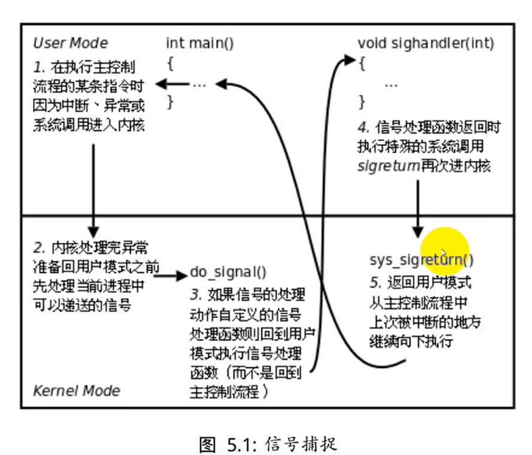
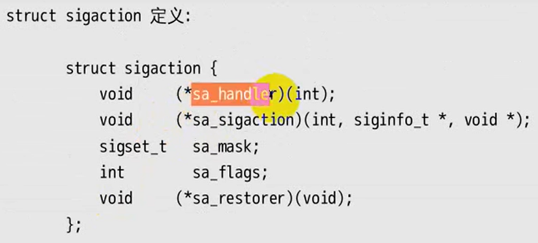
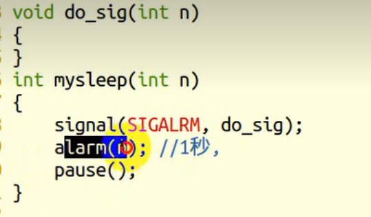
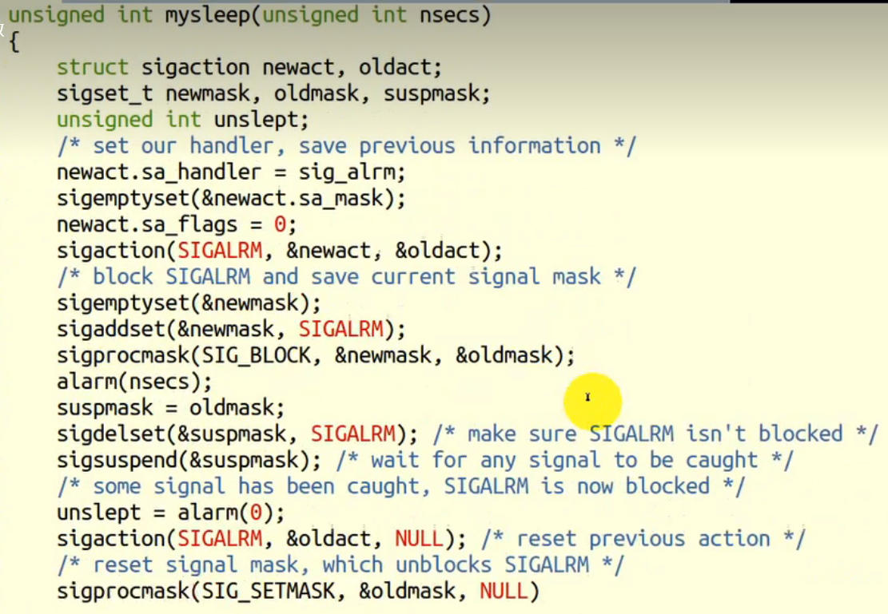
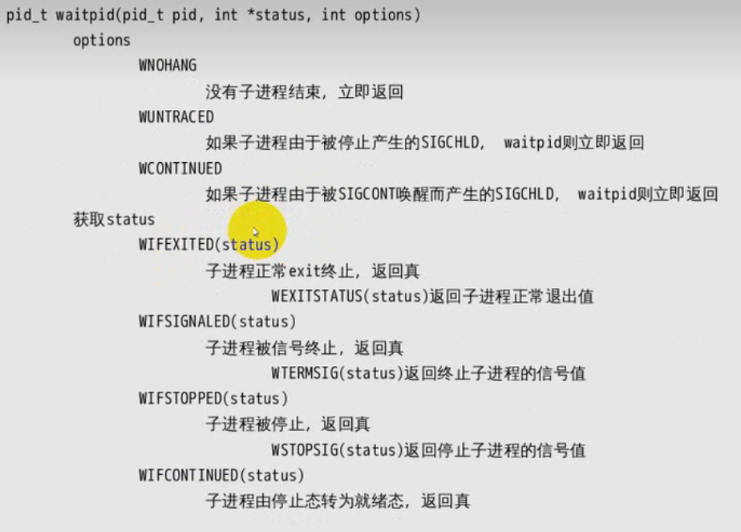

# `Linux`系统编程

## `Linux`基本命令

### `shell`

### 快捷键

### 命令

##### 文件目录

`~`表示用户目录`home/xmd`

##### `cd`&&`ls`

`.`表示当前路径，`..`表示上级目录

##### `which`

##### `mkdir`

##### `rmdir`

##### `tough`

##### `rm`

递归删文件

##### `mv`

##### `cp`

##### `cat`

##### `more`

##### `less`

##### `head`

##### `tail`

##### 	`ln`

##### `wc`

##### `od`

##### `du`

##### `df`

##### 文件信息详解

##### `whoami`

##### `chmod`

##### `chown`

##### `chgrp`

##### `find`

##### `grep`

##### `apt-get`

##### `deb`安装

##### 源码安装

##### `mount`

挂载`U`盘

##### `dd`

##### `tar`

##### `who`

##### `ps`

##### `jobs`

`fg`

##### `bg`

##### `kill`

##### `env`

##### `source`

配置文件内容生效

##### 创建用户

##### `root`用户

##### `ifconfig`

##### `netstat`

##### `man`

##### `echo`

##### `shutdown`

##### `free`

查看空闲内存

## `FTP`&`NFS`

`FTP`

文件传输协议

### `NFS`

`clientA`对目录`mnt`的操作就是对网络文件服务器`nfsserver`的操作

## `SSH`

## `telnet`

明文传输数据

## `VIM`

### `VI`简介

### 三种模式

#### 命令行模式

#### 文本输入模式

#### 末行模式

#### 基础操作

#### `vim`打造`ide`

利用相关配置，打造自定义的`vim`代码编辑`ide`

## `gcc`

## 静态库和共享库

`soname`是在运行时判断可执行文件是否可以在现在的环境中运行

### 静态库

好处是在任何一台电脑上都可以执行，不好的地方在于因为将静态库已经编译进了可执行文件中，所以代码体积大

### 共享库

好处是代码体积小，但是运行时依赖于本地环境存在共享库且版本号要一致

## 文件`IO`

### 阻塞和非阻塞

### `open`

### `ISEEK`

### `fcntl`

### `ioctl`

## `ext2`文件系统

### 一个递归所有文件的程序

## 虚拟文件系统

### `dup/dup2`

不会新创建`file`结构体，而`open`会新创建`file`结构体

## 进程

### `exec`

### `wait/waitpid`

`options`参数可以选择非阻塞

#### 孤儿进程和僵尸进程

## 进程间的通信

### `pipe`

### `fifo`

磁盘的索引去索引内核中的`pipe`

### `mmap`

## `gdb`

## `MakeFile`

### `clean`

## `shell`

## 信号

### 进程处理信号的行为

`block`阻塞信号集又叫信号屏蔽字

### `sigaction`

## 可重入和时序竞态

### 可重入函数

在信号捕捉函数里面禁止调用不可重入函数

### 时序竞态

改进之后

## 全局变量异步IO

使用定义好的变量和`volatile`关键字

## `SIGCHLD`使用

### 产生条件

### `status`

